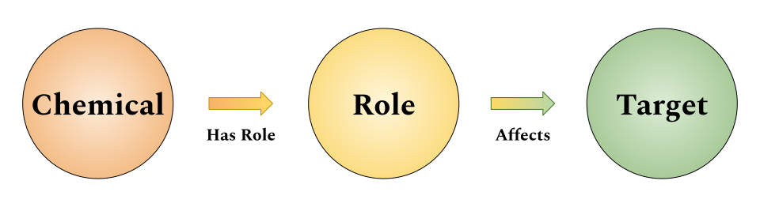

## Motivation {.page_break_before}

The Chemical Entities of Biological Interest [@pmid:23180789; @pmid:26467479] ontology models chemicals, their classes, their roles, and their interrelations (Figure {@fig:overview}, left).
While many roles correspond to how their substituent chemicals affect proteins and other biological entities (see Figure {@fig:role-hierarchy}), this information is not formalized nor structured in the ChEBI ontology.
Ying *et al.* [@raw:ying2011] previously described how these correspondences could be theoretically formalized.
This article proposes a concrete schema and axioms through which these roles can be linked to their target entities (Figure {@fig:overview}, right), a suite of open source, reusable curation tools, and ultimately a manually curated database of relationships between chemical roles and their targets. 

{#fig:overview width="75%"}

Throughout this article, the term *role* (in the context of the ChEBI ontology) will be used in the colloquial sense described by Batchelor *et al.* [@isbn:9781607505341] rather than the formal sense prescribed by the Basic Formal Ontology [@doi:10.3233/AO-160164; @arxiv:1502.04108].

This article has been typeset with Manubot [@doi:10.1371/journal.pcbi.1007128].
Along with each named entity, we are piloting Manubot's new feature to link to entities via Identifiers.org compact URIs (CURIEs).
