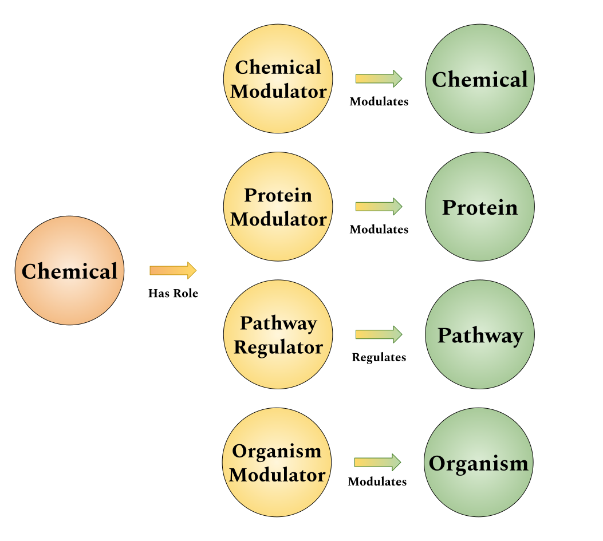

## Extension of the ChEBI Schema

Before generalizing the rules for the relationships between targets, it is best to examine a specific example. Chemicals that have the role p53 activator [@chebi:77731] obviously affect a certain target.
The type of effect is directly activates [@url:http://purl.obolibrary.org/obo/RO_0002406].
The type of the target is protein [@PR:000000001]. The target itself is the protein encoded by the TP53 [@hgnc:11998] gene^[Throughout this article, genes and their protein products will be referenced by their human gene symbol and HGNC identifier unless otherwise noted to improve readability.].
Because the chemical CBL0137 [@chebi:138650] has the role p53 activator [@chebi:77731], it can be inferred that CBL0137 [@chebi:138650] directly activates TP53 [@hgnc:11998].

While Ying *et al.* [@raw:ying2011] exemplified the formalization of the relationship between roles from the ChEBI ontology and their targets using the Manchester syntax^[https://www.w3.org/2007/OWL/draft/ED-owl2-manchester-syntax-20081128] to convey OWL-DL, this article will only informally describe axioms.
It is intended that these descriptions are easily understandable such that the focus can remain on the practical utility of the relations curated and inferred during the work described here.
The following informal amalgamation of a shape expression (common to graph query languages like SPARQL) and predicate logic outlines how to infer if a chemical __C__ is an activator of protein __P__ given it has the role __R__ and role __R__ is related to the activation of protein __P__.

{.page_break_before}

|         | Antecedent                                                   | Consequent                     |
|---------|--------------------------------------------------------------|--------------------------------|
| ChEBI   | __C__ a Chemical __R__ a Role __C__ has role __R__ |                                | 
| Curated | __P__ a Protein __R__ role for directly activates __P__ | __C__ directly activates __P__ |

Table: Shape expression and predicate logic rules for inferring chemicals that activate proteins linked to a given role (could be stated more concisely in OWL as *has_role o role_for_directly_activates -> directly_activates*). {#tbl:table-1}

The ChEBI ontology can be used to determine if chemical __C__ has the role __R__, but not whether __R__ is related to protein __P__, or any other protein for that matter.
This motivates the generation of a database of relations between ChEBI roles that activate proteins to support this type of inference.
After generalizing to other relationships and entity types, we generated such a database and included it with this article.

However, there are ChEBI roles that imply relations to proteins besides directly activates, so this definition needs to be generalized.
First, it should be noted that the relationship between role __R__ and protein __P__, "role for directly activates" was not taken from an ontology.
It was named based on the relation between chemical __C__ and protein __P__ that role __R__ implies.
In practice, this means that "role for" is added as a prefix.
In this example, role __R__ that corresponds to the relation "directly activates" between chemical C and protein __P__ is called "role for directly activates".
A database of relations between ChEBI roles and proteins should include the directly activates relation, but also others such as the directly inhibits [@url:http://purl.obolibrary.org/obo/RO_0002408], agonist of, antagonist of, and inverse agonist of relations^[It should be noted that the pharmacological relationships agonist, antagonist, and inverse agonist are well-defined in ChEBI, but not so much so in standardized ontologies of relationships between biochemical entities such as the Relation Ontology. See GitHub discussions at oborel/obo-relations#369 and oborel/obo-relations#371.].
The shape expression and predicate logic can be updated to reflect the relation m between role __R__ and protein __P__ that corresponds to the externally defined relation __M__ between chemical __C__ and protein __P__.

|         | Antecedent                                                            | Consequent                     |
|---------|-----------------------------------------------------------------------|--------------------------------|
| ChEBI   | __C__ a Chemical __R__ a Role __C__ has role __R__          |                                | 
| Curated | __P__ a Protein __R__ __m__ __P__ __m__ correspondsTo __M__ | __C__ __M__ __P__              |

Table: Shape expression and predicate logic rules generalized for additional relationships. {#tbl:table-2}

Again, since __m__ is dependent on external relationship __M__, it is acceptable to use relationships __M__ during curation to mitigate the need for additional ontologizing.
Therefore, an entry in the database could contain the role, relationship, and protein as shown in Table {@tbl:table-3}.

| Role        | Relationship | Protein    |
|-------------|--------------|------------|
| CHEBI:77731 | RO:0002406   | HGNC:11998 |

Table: An example database entry. {#tbl:table-3}

Further, there are ChEBI roles that imply relations to entities other than proteins, so this definition must be generalized.
Rather than discussing relationships between role __R__ and protein __P__, it would suffice to discuss relationships between role __R__ and target __T__.
The relationships themselves that are appropriate should already have well-defined semantics that dictate what types of entities are valid for the range.
This article will use externally defined relationships from sources like the Relation Ontology (RO) [@https://github.com/oborel/obo-relations] when possible and avoid discussion of these semantics.
In many cases, roles __R__ can be categorized based on the types of targets __T__ that they affect (Figure {@fig:role-generalization}).

{#fig:role-generalization width="75%"}

In many cases, it is unclear what the type of entity a given ChEBI role implies.
Therefore, the database also includes explicit annotation of entity types.
This is also helpful when using databases that contain multiple entity types, such as the Gene Ontology (GO) [@doi:10.1093/nar/gky1055], and should serve to dissuade users from inferring entity types based on databases.
Now, an entry in the database should contain a role, relation, type, and target as shown in.

| Role        | Relationship | Type    | Target     |
|-------------|--------------|---------|------------|
| CHEBI:77731 | RO:0002406   | Protein | HGNC:11998 |

Table: An example database entry with entry type. {#tbl:table-4}

While not strictly necessary for the reasoning described above, it could be advantageous to enrich the existing role hierarchy with further roles that directly correspond to a given relationship and entity type (Figure {@fig:role-hierarchy}), such that maintenance of children of these terms would only necessitate the curation of the target itself.

![A hierarchy of chemical roles. Each role corresponds to a chemical having a given relationship. Within the ChEBI hierarchy, the role [@CHEBI:50906] has three children: chemical role [@CHEBI:51086], biological role [@CHEBI:24432], and application [@CHEBI:33232]. Our interest lies with the latter two.](images/figure_3_role_hieararchy.svg){#fig:role-hierarchy width="100%"}

For example, the role enzyme inhibitor [@CHEBI:23924] clearly corresponds to the entity type being protein family and the relation being directly inhibits [@url:http://purl.obolibrary.org/obo/RO_0002408].
Therefore, descendents such as EC 3.4.24.71 (endothelin-converting enzyme 1) inhibitor [@CHEBI:82974] can directly be inferred to directly inhibit a protein family.
All that would be necessary is to annotate the identity of that family, endothelin-converting enzyme 1 [@EC-CODE:3.4.24.71].
While this is already well-defined for enzyme inhibitors, it is not for other roles.
Figure {@fig:role-hierarchy} proposes a possible hierarchy of additional roles corresponding to relations and target types.
Note that proteins and protein families are considered equivalent in this context.
This article will not fully explore this concept, though during curation, several oddities were identified, such as the fact that pathway inhibitor [@CHEBI:76932] is a subclass of enzyme inhibitor [@CHEBI:23924].
