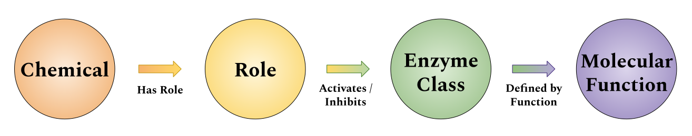
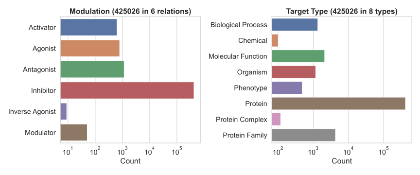

# Inference

Before outlining a generalized strategy for inference, the liver X receptor inverse agonist [@CHEBI:90846] will be presented as an example role corresponding to the inverse agonism of the LXR family of proteins.
Its definition implies that chemicals that have this role should be inferred to affect the two members of this family LXRα [@HGNC:7966] and LXRβ [@HGNC:7965].
Therefore, the shape expression from Table {@tbl:table-2} can be extended to handle protein families over which inference should be extended to their respective members in Table {@tbl:table-5}.

|          | Antecedent                                                                   | Consequent                     |
|----------|------------------------------------------------------------------------------|--------------------------------|
| ChEBI    | __C__ a Chemical __R__ a Role __C__ has role __R__                 |                                | 
| Curated  | __G__ a Protein Family __R__ __m__ __G__ __m__ correspondsTo __M__ |                                |
| External | __P__ a Protein __P__ a __G__                                           | __C__ __M__ __P__              |

Table: Shape expression and predicate logic rules for reasoning over protein family memberships. {#tbl:table-5}

However, we have a number of hierarchical resources besides proteins, and sometimes these resources are several levels deep.
Additionally, chemicals and roles both have their own hierarchies by ChEBI.
In Table {@tbl:table-6}, the `a*` notation is to show variable length traversals through "is a" relationships.
This means if `A a B` and `B a C`, then A a\* C is true. This holds for chains of arbitrary length.
In the context of the `a*` operator, it is also true that `A a A`.
Finally, Table {@tbl:table-6} presents a fully generalized inference framework.

|          | Antecedent                                                                                              | Consequent                     |
|----------|---------------------------------------------------------------------------------------------------------|--------------------------------|
| ChEBI    | __C__ a Chemical __R__ a Role __c__ a\* __C__ __r__ a\* __R__  __c__ has role __r__ |                                | 
| Curated  | __T__ a Target __r__ __m__ __T__ __m__ correspondsTo __M__                                    |                                |
| External | __t__ a\* __T__                                                                                         | __c__ __M__ __T__              |

Table: A fully generalized shape expression and predicate logic rules for inference over hierarchies. {#tbl:table-6}

### Linking Roles to Gene Ontology Molecular Functions through Enzyme Classes

{#fig:go-schema}

Following the exhaustive mapping from chemical roles classifying activators or inhibitors of given enzyme classes, the EC2GO mapping [@https://geneontology.org/ontology/external2go/ec2go] provided by GO can be applied to infer on to which molecular function each chemical role exerts its effect.
Like in the first example where relation m between role __R__ and target __T__ was defined based on relation __M__ between chemical __C__ and target __T__, we define relation __M~F~__ to correspond to the relationship between a chemical and a molecular function corresponding to a given enzyme as shown in Table {@tbl:table-7}.

|          | Antecedent                                                                                                 | Consequent                                  |
|----------|------------------------------------------------------------------------------------------------------------|---------------------------------------------|
| ChEBI    | __C__ a Chemical __R__ a Role __C__ has role __R__                                               |                                             | 
| Curated  | __E__ an Enzyme __R__ __m__ __E__ __m__ correspondsTo __M__ __m__ correspondsTo~F~ __M~F~__ |                                             |
| GO | __F__ a Molecular Function __E__ hasFunction __F__                                                          | __C__ __M__ __E__ __C__ __M~F~__ __F__ |

Table: Shape expression and predicate logic rules inferring chemical relations to molecular functions. {#tbl:table-7}

### Implementation
 
 The acquisition of external resources and inference over hierarchies is accomplished by a simple script whose installation and execution is mediated by the Tox [@https://tox.readthedocs.io] configuration available at https://github.com/chemical-roles/chemical-roles.
 It relies heavily on the PyOBO Python package [@https://github.com/pyobo/pyobo] to acquire hierarchical data sources from OBO Foundry and generate OBO-like structures for several other resources, notably HGNC, GO, InterPro, etc.
 
### Summary Statistics

Inference over entity hierarchies resulted in over 424K new relationships.
Figure {@fig:inference-summary} summarizes them by modulation and target entity type.
Notice that each has increased by several orders of magnitude essentially for free by leveraging a vast amount of previously curated, high quality content.

{#fig:inference-summary}
